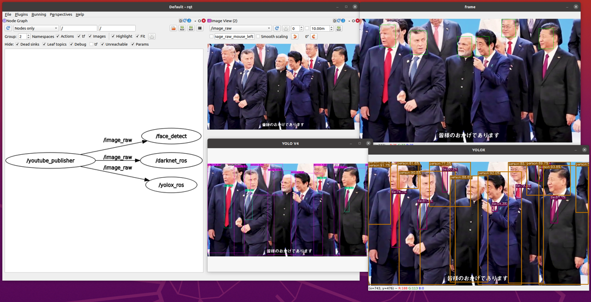

# YouTube-publisher-ROS2

Publish sensor_msgs/Image by "YouTube" :hugs: :hugs: :hugs: !

You don't have to use webcamera or your video to check demos.




## Purpose

- Quick demo :rocket:
- Comparison performance :thinking:
- Sharing your results :incoming_envelope:

## Requirements

- ROS2 Foxy
- OpenCV4
- [youtube-dl](https://github.com/ytdl-org/youtube-dl/) : Re-sharing of acquired videos from YouTube is prohibited.
- [ffmpeg-python](https://github.com/kkroening/ffmpeg-python)


## Installation

```bash
mkdir -p ~/ros2_ws/src
cd ~/ros2_ws/src
git clone https://github.com/Ar-Ray-code/YouTube-publisher-ROS2.git
pip3 install -r YouTube-publisher-ROS2/requirements.txt
cd ~/ros2_ws
colcon build --symlink-install
```


## Demo with YOLOX-ROS

### Build

```bash
# YOLOX installation
cd ~/Documents/
git clone --recursive https://github.com/Megvii-BaseDetection/YOLOX
cd ~/Documents/YOLOX
pip3 install -U pip && pip3 install -r requirements.txt
pip3 install -v -e .  # or  python3 setup.py develop
pip3 install cython; pip3 install 'git+https://github.com/cocodataset/cocoapi.git#subdirectory=PythonAPI'

# ROS2 Installation
cd ~/ros2_ws/src

git clone https://github.com/Ar-Ray-code/YouTube-publisher-ROS2.git
git clone https://github.com/Ar-Ray-code/YOLOX-ROS.git --recursive
pip3 install -r YouTube-publisher-ROS2/requirements.txt

cd ~/ros2_ws
colcon build --symlink-install
```

### Run

```bash
ros2 launch youtube_publisher youtube_publisher_yolox.launch.py
```


## Parameter

Look the launch.py file !

```python
youtube = launch_ros.actions.Node(
        package='youtube_publisher', executable='youtube_pub',
        parameters=[
            {'topic_name': '/image_raw'},
            {'cache_path': youtube_publisher_share_dir + '/cache'},
            {'video_url' : 'https://youtu.be/CFLOiR2EbKM'},
            {'using_youtube_dl' : True},
            {'clear_cache_force' : False},
            {'width' : 854},
            {'height' : 480},
            {'speed' : 1.0},
            {'imshow_is_show' : True}
        ],
    )
```

- `topic_name `: Publish topic name（Default : `image_raw`）
- `cache_path `: Path of the video to be saved（Default : `~/cache/youtube_publisher`）
- `video_url` :  YouTube Video URL（Default : `https://youtu.be/CFLOiR2EbKM`）
- `using_youtube_dl` : Automatically download video from YouTube when it is not downloaded. （Default : True）
  - If you run it again, it will load the cache and will not be downloaded.
  - If URL is re-writtten, it will be cleared cache and re-downloaded.
- `clear_cache_force` : Clear cache and re-download force. （Default : False）
- `width` : Width of publishing video. Not about downloaded video width.（Default : 720）
- `height` : Height of publishing video. Not about downloaded video height.（Default : 480）
- `speed` : Video playback speed.（Default : 1.0）
- `imshow_is_show` : Video visualization with imshow. （Default : False）
  - True : show, False : Don't show


